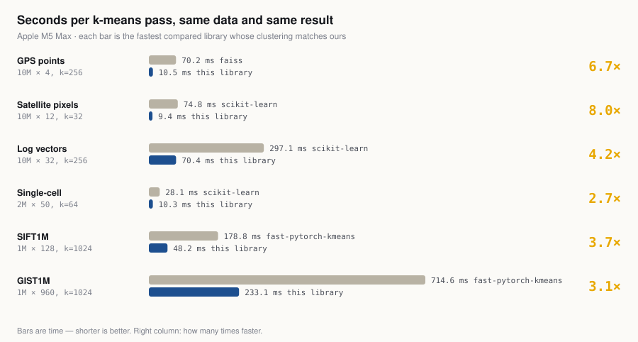
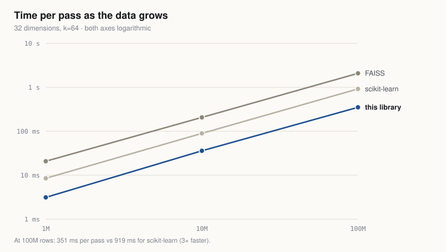
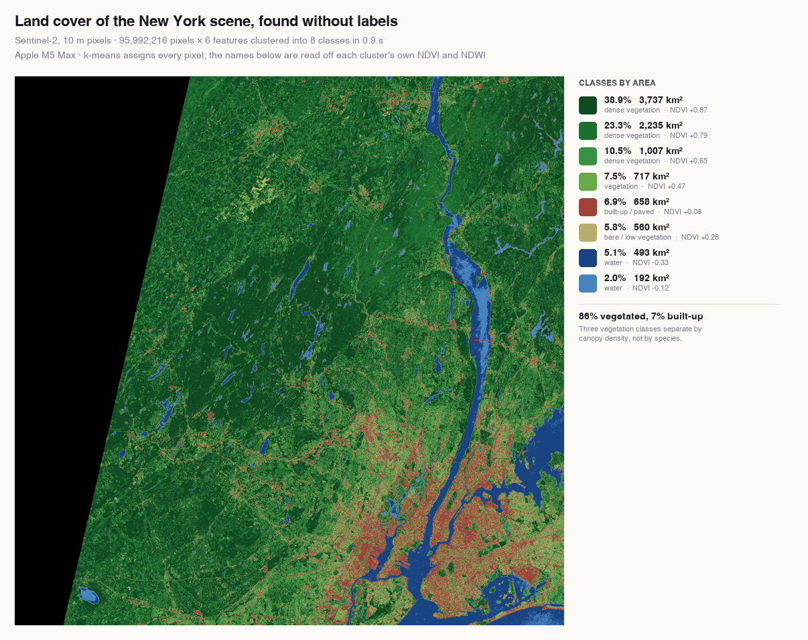

# mlx-kmeans

**K-means clustering on Apple Silicon GPUs.** Cluster local CSV/Excel files or NumPy/MLX arrays, assign rows to
groups, and export labels and cluster summaries. Every Lloyd iteration uses all input rows; initialization uses
a subsample. Data stays on your Mac.

**Measure it on your own Mac first.** Four lines, no administrator password, Homebrew or Git: this downloads the
repository, sets up a private Python inside the folder, runs the benchmark and prints a report. `curl` and `ditto`
ship with macOS.

```bash
cd /tmp
curl -L https://github.com/kakollu/mlx-kmeans/archive/refs/heads/main.zip -o mlx-kmeans.zip
ditto -x -k mlx-kmeans.zip . && cd mlx-kmeans-main
./no_admin_bench.sh
```

`./no_admin_bench.sh --cleanup` afterwards removes everything it installed and keeps the report. What it measures,
what it does not, and the etiquette on a machine that is not yours: [Benchmark without administrator
access](#benchmark-without-administrator-access).

Start with the [file guide](docs/USING_YOUR_FILES.md), [notebook](examples/cluster_your_file.ipynb), or
[Python API](#api). To see it on real data at scale, open
[examples/satellite_landcover.ipynb](examples/satellite_landcover.ipynb) — 96M satellite pixels clustered into
land-cover classes, with saved outputs so it reads without running.

On a 128 GB M5 Max, six measured workloads ran **3.5–22× faster per pass** than the quickest valid time of the
libraries compared — scikit-learn, FAISS and fast-pytorch-kmeans — with matching final inertia. Per-config numbers, and
how far each one is from what the hardware allows, are in [BENCHMARKS.md](BENCHMARKS.md); conditions and an
independent rerun are in [benchmarks/VERIFICATION-2026-09-19.md](benchmarks/VERIFICATION-2026-09-19.md), which
measured 2.2–8.1× before the September 24–25 kernel work. Seven Apple Silicon machines have been measured:
[benchmarks/MACHINES-2026-09-24.md](benchmarks/MACHINES-2026-09-24.md).

**What it is, and is not.** Exact and deterministic by default: every label is the float64-optimal one to float32
resolution, and a rerun gives the same bits. The margins above are widest on the low-dimensional, large-row-count
shapes and narrowest at high dimensions. Two limits worth knowing: below a few hundred thousand rows the GPU
round trip is the floor and scikit-learn can win, and there is no batched interface, so many small problems (the
sub-quantizers of a product quantizer, say) each pay their own launches and round trips. `exact=False` gives up
exactness for 1.1–2.7× at 64+ dims where that pays. Against the hardware itself — one read of the data, or the multiply at the
matrix unit's ceiling — the passes sit at 1.4× on the high-dimensional shapes and 2.7–7× on the low-dimensional
ones; `benchmarks/possible.py` and the floor column say exactly where.

For a local file, after installing `.[files]`:

```bash
python -m mlx_kmeans customers.csv                         # inspect column names
python -m mlx_kmeans customers.csv --columns annual_spend orders visits --k 3 --nstart 10
```

A new results folder contains the original rows with cluster labels, group means in original units, and run
settings. Features are standardized by default; IDs stay out unless explicitly selected. Files are not uploaded.

```bash
pip install git+https://github.com/kakollu/mlx-kmeans.git
```

(Not on PyPI yet — that one line installs it straight from this public repository.)

```python
import numpy as np
from mlx_kmeans import KMeans

X = np.random.rand(1_000_000, 32).astype(np.float32)   # your data: (rows, dims) float32
model = KMeans(n_clusters=64).fit(X)

model.cluster_centers_   # (64, 32) - the centers
model.labels_            # (1_000_000,) - which cluster each row belongs to
model.inertia_           # total squared distance - lower is better
```

Requires an Apple Silicon Mac (M1 or later) and Python 3.9+. That's the whole setup.



Figure: generated by `scripts/make_figures.py` from `benchmarks/results.jsonl`, latest run per config.

---

## Preparing your data

This implements Lloyd's k-means with a Python API resembling scikit-learn's. Initialization, stopping criteria,
and numerical details can produce different clusters. Three things worth knowing:

**1. It wants float32.** Call `X.astype(np.float32)` before fitting; float64 arrays are converted anyway, at the
cost of a copy.

**2. Standardise your features first**, exactly as you would anywhere else. k-means measures straight-line distance,
so a column in dollars will drown out a column in miles:

```python
Z = ((X - X.mean(0)) / (X.std(0) + 1e-9)).astype(np.float32)
model = KMeans(n_clusters=8, random_state=0).fit(Z)
centers = model.cluster_centers_ * X.std(0) + X.mean(0)      # back to real units to read them
```

**3. Profile the clusters before believing them** — sizes, the mean of each feature per cluster, and a few rows
nearest each center. In the taxi demo below, two of eight segments turned out to differ by *payment method* rather
than by behaviour: the meter only records a tip when the fare is paid by card.

**Small datasets may be faster with scikit-learn.** In the September 19 rerun, 100k rows × 32 features with 64
clusters took 3.51 ms/pass here versus 1.59 ms for scikit-learn. A 100k × 8, k=8 case was roughly tied with FAISS.
The crossover depends on shape, not just row count.

The reason is latency, not arithmetic (measured September 20 on battery power). A GPU round trip costs about
0.14 ms on this machine, and a Lloyd pass here spends roughly 0.9 ms on fixed per-pass cost before it touches
any data — crossing back to the host for the
float64 center update and the convergence check. That floor is flat in row count, so it is invisible at 10M rows
and decisive at 10k. Work only overtakes it above roughly 300k rows at 32 features, after which a pass grows at
about 2 ns per row. Seeding used to add a second fixed cost of one round trip per cluster — the larger of the two
at high k, the smaller at low k, where a few iterations of the pass floor outweigh it — and that one is now
removed (see *Where the speed comes from*). The per-pass floor remains. **If you cluster many small datasets in
a loop, you pay this floor on every iteration — measure before assuming the GPU helps.**

## What your Mac can handle

**Measured machine: 128 GB M5 Max MacBook Pro, on AC power.** The timings below apply to this machine; the M5 Max
row of the table was re-measured on September 25, the other machines on September 24.

**MacBook Air: measured, not estimated.** On September 24 the benchmark was run on six Apple Silicon machines
in an Apple Store, each printing a fingerprint of the code it executed so the runs can be tied to a revision.
A 16 GB M5 MacBook Air clustered **37 million rows by 32 features into 1,024 clusters at 1.90 s per pass**, and
ten million rows by twelve features in 26.5 ms. An A18 Pro MacBook with five GPU cores and 8 GB still reached
16.7 million rows.

| Machine | GPU cores | RAM | 10M × 12, k=32 | Largest case it chose |
|---|---:|---:|---:|---|
| M5 Max, MacBook Pro | 40 | 128 GB | 0.0071 s (0.0032 after the September 25 fused kernel) | 200M rows (capped) |
| M5 Pro, MacBook Pro | 20 | 48 GB | 0.0112 s | 117M rows |
| M5 Max, Mac Studio | 32 | 36 GB | 0.0082 s | 87.8M rows |
| M5 Pro, Mac mini | 16 | 24 GB | 0.0133 s | 55.5M rows |
| **M5, MacBook Air** | 10 | 16 GB | **0.0265 s** | **37.0M rows** |
| A18 Pro, MacBook | 5 | 8 GB | 0.0542 s | 16.7M rows |

These were retail display units: unknown thermal state, no power or background-load control, one run each.
They show the library runs across the range and roughly how fast, not a controlled cross-machine study — small
shapes in particular are noisy enough that a 20-core machine beat a 32-core one on them. Full numbers and
caveats: [benchmarks/MACHINES-2026-09-24.md](benchmarks/MACHINES-2026-09-24.md).

`python3 quick_bench.py` measures your own Mac the same way. Also time `.fit()` on your actual data, since
per-pass timings exclude initialization and data preparation.

### Benchmark without administrator access

`no_admin_bench.sh` is for an Apple Silicon Mac where you can use Terminal but do not have Homebrew, Git, or an
administrator password. It uses an available Python 3.9+ when possible. If Python is absent or unusable, it downloads
a private fallback inside the repository. It installs the required packages, runs `quick_bench.py --big`, and saves
a timestamped text report under `benchmarks/`. It does not use `sudo` or change the shell profile. Internet access to
GitHub and Python package downloads is required; the fallback also needs access to Astral. A managed Mac can still
block downloads or execution.

**On a machine that is not yours.** A store display Mac is there to be tried, and running the work you actually
care about is a fairer test than a spec sheet — that is the case this script was written for. Leave it as you
found it: `./no_admin_bench.sh --cleanup`, delete the folder, and take the report with you. A borrowed laptop or
a work or university machine is a different matter, since those are not there to be evaluated; ask first.

Download it as a ZIP. `curl` and `ditto` ship with macOS, so this needs no install of any kind — and on a Mac
without developer tools, typing `git` triggers a multi-minute Xcode Command Line Tools download you do not need
(measured: about five minutes on a store machine):

```bash
cd /tmp
curl -L https://github.com/kakollu/mlx-kmeans/archive/refs/heads/main.zip -o mlx-kmeans.zip
ditto -x -k mlx-kmeans.zip .
cd mlx-kmeans-main
./no_admin_bench.sh
```

If you already have Git, a clone works the same way:

```bash
git clone https://github.com/kakollu/mlx-kmeans.git
cd mlx-kmeans
./no_admin_bench.sh
```

Copy the printed `benchmarks/no-admin-*.txt` report before leaving a temporary machine. Afterwards, this removes
only the script-owned Python, environment, tools, and download cache; it deliberately preserves the report:

```bash
./no_admin_bench.sh --cleanup
```

This benchmark sizes its largest case from MLX's recommended GPU working set. It measures time per k-means pass,
not complete convergence or maximum safe capacity. To test the existing billion-row regression after setup:

```bash
.no-admin-bench/venv/bin/python -m mlx_kmeans --rows 1000000000 --dims 8 --k 16
```

### Run a simple benchmark on your MacBook Air

```bash
git clone https://github.com/kakollu/mlx-kmeans.git
cd mlx-kmeans
python3 -m venv .venv
.venv/bin/python -m pip install '.[benchmark]'
.venv/bin/python air_bench.py --cleanup-after
```

**The last command runs the benchmark.** It prints both complete clustering times in one table, states which
finished faster, and compares clustering error on the same data. An MLX loss is reported as a loss.
The result is specific to your machine and this workload; an M5 Max advantage does not imply an Air advantage.

Optional: `air_bench.py --plan` only previews the memory budget; it does **not** run anything. Power and memory
details are saved in the report; add `--details` to also print them. The benchmark:

- Chooses up to five million valid taxi transactions using installed RAM, currently available memory, and MLX's
  recommended GPU working set. It budgets at most 25% of RAM, 40% of available memory, or 2 GiB, whichever is lower
  (also limited to 25% of the GPU recommendation). These are conservative working-memory estimates, not guarantees.
- Downloads **one January 2015 taxi file, about 167 MiB**, only after the memory check and a disk-space check.
  It does not download SIFT, GIST, embeddings, or a whole year of taxi records. The complete compressed month is
  stored on disk; only a RAM-sized prefix of valid rows is processed, in batches. This is a benchmark sample,
  not a representative sample for business analysis.
- Measures loading, feature preparation, and complete fitting with labels. Both methods receive the **same rows
  and features**. Their own initialization and stopping rules are included in the complete fitting time, so different
  iteration counts are expected. This answers which finished sooner for this run. Clustering error is calculated
  for both with the same float64 metric outside the timing; lower is better.
- Saves a timestamped JSON report in `benchmarks/local-*.json` with the actual chip, RAM, power settings, row count,
  iterations and timings. This measures the Air itself rather than projecting from the M5 Max.

Plug in power and close heavy apps for comparable results. You can lower the workload further:

```bash
.venv/bin/python air_bench.py --rows 1000000 --memory-mib 512 --cleanup-after
```

For an additional controlled check, run `.venv/bin/python air_bench.py --controlled --cleanup-after`.
This also compares **one Lloyd update plus final labels from identical starting centers**, using the median of three
warmed runs in alternating order. It excludes initialization and GPU input conversion and includes scikit-learn's
internal fit preparation. This diagnostic is separate from the complete training result; it cannot replace it.

Omit `--cleanup-after` to retain the file for repeat runs; the cached file is integrity-checked before reuse.
Clean it up later with `.venv/bin/python air_bench.py --cleanup`. Cleanup removes only this script's owned files
under `data/air-benchmark/`, including incomplete downloads. It preserves reports, other datasets, the repository,
and your virtual environment. `--no-compare` skips scikit-learn. The benchmark does not change your Mac's settings.

## Benchmarks

Time per pass on AC power (latest run per config, September 24–25) against the quickest tested library whose
**final inertia matches within 0.01%** (not necessarily identical labels). Same data and starting centers; median
of three five-iteration runs. Scikit-learn time is divided by six to credit its final assignment pass.
Initialization is excluded. The first four workloads are synthetic shapes; SIFT and GIST are real datasets. The
floor is one read of the data at the measured DRAM rate or the multiply at the measured matrix-unit ceiling,
whichever is larger; the last column is how far the pass is from it.

| Problem | Shape | This library | Quickest valid public | Ratio | Floor | Ours ÷ floor |
|---|---|---|---|---|---|---|
| GPS / trip points | 10M × 4, k=256 | 9.2 ms | FAISS 65.6 ms | **7.1×** | 1.3 ms | 7.1× |
| Satellite pixels | 10M × 12, k=32 | 3.2 ms | scikit-learn 71.1 ms | **22.5×** | 1.0 ms | 3.2× |
| Log / feature vectors | 10M × 32, k=256 | 27.8 ms | scikit-learn 290.3 ms | **10.4×** | 10.4 ms | 2.7× |
| Single-cell (after PCA) | 2M × 50, k=64 | 4.4 ms | scikit-learn 28.1 ms | **6.4×** | 0.8 ms | 5.4× |
| SIFT1M vectors | 1M × 128, k=1024 | 22.8 ms | fast-pytorch-kmeans 174.6 ms | **7.7×** | 16.7 ms | 1.4× |
| GIST1M vectors | 1M × 960, k=1024 | 176 ms | fast-pytorch-kmeans 608.1 ms | **3.5×** | 125 ms | 1.4× |

The per-pass number understates a fit at 256+ dimensions: consecutive iterations there reuse per-centre distance
bounds: a GIST fit to tolerance on 300k rows (26 iterations) went 1.85 → 1.05 s, and 20 fixed iterations on the
1M rows 3.51 → 1.62 s. Five passes cannot show it; a fit-to-tolerance config is not in the suite yet.

A historical 12-shape sweep is recorded in `benchmarks/NOTES.md`; it was not repeated in full on September 19.



Historical scaling measurements; not rerun on September 19.

**Complete training matters more than per pass.** September 19–20 SIFT1M rerun (1M × 128, k=1024), three seeds per
method. Times include initialization and training, but exclude loading, input conversion, and final label/index
construction. Methods use different initialization and stopping settings; see the verification report. This
library's pass on this shape has since gone from 57.6 to 22.8 ms; the training comparison was not re-run.

| Method | Median train time | Observed train range | recall@10 range, nprobe=8 |
|---|---|---|---|
| **This library, all rows (core training)** | **2.50 s** | 2.46–2.59 s | 84.82–84.89% |
| FAISS default (trains on a 262k sample) | 4.96 s | 4.93–5.08 s | 84.15–84.22% |
| scikit-learn MiniBatchKMeans | 12.88 s | 10.92–13.30 s | 83.51–84.09% |
| FAISS, all rows | 18.46 s | 18.23–18.49 s | 84.45–84.67% |
| scikit-learn, all rows | 181.70 s | 181.35–187.07 s | 84.70–84.96% |

Full-data quality is similar; these runs do not establish universal quality superiority. The billion-row CLI
regression also completed: 1B × 8 synthetic rows, k=16, 0.7 s generation and 1.7 s training on this M5 Max.
That CLI generates input directly on the GPU and does not return final labels.

Historical synthetic 100M × 32, k=1024 runs recorded approximately 12 s here, 270 s for scikit-learn, and 532 s
for FAISS. These are different training configurations: the harness explicitly chose random initialization for
scikit-learn above 20M rows and capped competitors at 25 iterations. Their 3.4–3.9× higher inertia does not
establish an inherent library quality disadvantage. These large competitor runs were not repeated on September 19.
The historical 84-minute MiniBatchKMeans run was stopped without finishing.

### Check the numbers yourself

```bash
git clone https://github.com/kakollu/mlx-kmeans && cd mlx-kmeans
python3 -m venv --system-site-packages .venv
.venv/bin/pip install . scikit-learn faiss-cpu torch fast-pytorch-kmeans
python3 scripts/get_data.py sift gist      # public benchmark sets, no account needed
.venv/bin/python bench.py --suite          # regenerates BENCHMARKS.md
.venv/bin/python tests/accuracy.py         # 22 correctness cases against float64
.venv/bin/python tests/reuse.py            # fit here, predict there: cached state, input checks
```

Every table in `BENCHMARKS.md` is generated from `benchmarks/results.jsonl`, which records the machine, the git
commit, sampled background CPU load, and median/minimum/maximum timings. A public library whose final inertia differs from ours
by more than 0.01% is marked *different work* and excluded, rather than quietly counted.

## Where the speed comes from

The assignment kernels evaluate nearest centers in float32, with finite-case validation against a float64
reference. The gains are in how the work is laid out on the GPU. The optimization comparisons below are historical
experiments recorded in `benchmarks/NOTES.md`, not fresh ablations in the September 19 verification.

| Change | Effect |
|---|---|
| **One GPU thread per row** instead of one per 4,096-row block | 9–43× at large k × dims. GPUs run threads in lockstep, and a thread looping over thousands of rows throws that away. |
| **Cache-local cluster totals** (rows sorted by cluster, summed in small blocks) | GIST1M totals: 4.16 s → 0.053 s. That step had been 89% of a pass. |
| **Metal SIMD-group matrix instructions** for distances | Historical high-dimensional experiments measured a ~3× gain. The default path refines candidate distances directly; the notes describe precision problems observed with the tested alternative matmul paths. |
| **Greedy k-means++ seeding on the GPU** | Initialization 18.1 s → 0.2 s at k=1024, and roughly 10× fewer iterations to converge. |
| **Seeding without a host sync per round** | Each of the k rounds does little work, so waiting for it made seeding cost k GPU round trips regardless of data size — 16 ms of a 19 ms fit at k=64 on 1k rows. Leaving the rounds unevaluated lets MLX pipeline them: 2–4× faster seeding, and the centers are bit-identical across k=8–1024 because only the timing of evaluation changed. What it saves is a fixed few tens of milliseconds per fit, so complete fits measured 1.1–1.9× faster between 1k and 100k rows and the gain fades to a few percent at millions of rows, where the fit is long enough that seeding was never the problem. |
| **GPU-generated input** | The billion-row CLI creates data on the GPU, avoiding a NumPy input copy. NumPy input through the public API can require additional storage. |
| **One-read fused kernel with the sums on the matrix unit** (k ≤ 128, dims ≤ 96) | Assigns a row and adds it to its cluster with one-hot tile multiplies, in one read of X: satellite 5.1 → 3.2 ms per pass, 20M × 8 k=16 8.3 → 2.8 ms, and within 7% of parity at worst where offered. Deterministic; centres bit-identical to the two-stage path. |

| **Per-center distance bounds between iterations** (Elkan's lower bounds, kept for every row × center) | After the first iteration or two, 97–99% of the n × k distances a pass computes cannot change any assignment; the bounds skip them, exactly. GIST 1M, k=1024: one iteration 175 → 50–63 ms in steady state, 20 iterations 3.51 → 1.62 s, 5 iterations 0.89 → 0.74 s; a fit to tolerance on GIST 300k 1.85 → 1.05 s. A 5-iteration benchmark moves least, which is why this stayed hidden. Built only when a sampled prediction says they will pay, so data they cannot help costs a few percent. Offered at 256+ dims where the n × k bounds fit (3.9M rows at k=1024), released with the data; a one-shot `predict` never allocates them. |

`BENCHMARKS.md` now carries a floor for every config — one read of the data at the measured DRAM rate or the
multiply at the measured matrix-unit ceiling, whichever is larger — and the pass's distance from it, so the table
says not only how we compare to other libraries but how far each shape is from this machine.

`benchmarks/NOTES.md` is the full record, including what *didn't* work: cache tiling (1.4×, so cache misses weren't
the cause), branch-free argmin (no effect), the center-to-center triangle-inequality test inside one pass (78% of
centers survive at 960 dims; the bounds carried *between* passes, above, are a different quantity), and a matmul
hybrid abandoned on precision grounds.

## Accuracy

`tests/accuracy.py` compares assignment paths and deterministic accumulation paths against a float64 reference;
it also tests rows/atomic accumulation where supported. Labels must be optimal within the stated float32-scale
tolerance; center and inertia errors must be within 1e-6 under the suite's metrics. Empty-cluster relocation is
checked against an independent reference, with one case also checked against scikit-learn. The multi-buffer
test's configuration wiring was repaired on September 19. These finite tests are evidence, not a proof for all inputs.
The suite passes **22/22 cases** on the measured M5 Max, five of them through the between-iteration bounds path (multi-step sequences with a restart mid-sequence and empty-cluster relocations, a subnormal-scale column with the float16 screen forced off, and centre coordinates past float16's range); the verification directory contains the full log. A second suite, `tests/reuse.py`, checks the fit-here-predict-there pattern: a second array of the same shape, batched predictions with one batch rescaled, and sliced inputs sharing a first part must never be served the previous array's cached state, and bad input must raise rather than abort the process.

## Demos on real public data

**Fresh business-workflow measurement:** January 2015 NYC taxi transactions, 12.59M retained rows × 6 features,
eight clusters: **0.134 s for public `KMeans.fit`, including labels**, and **1.414 s including local file loading,
filtering, feature construction and standardization**. This single M5 Max run excludes downloads, imports and
report generation; file-cache state was not controlled. See the verification report for stage timings. It is not
a MacBook Air projection.

```bash
python3 scripts/get_data.py taxi && .venv/bin/python demos/taxi_segments.py --k 8 --months 8
```

Historical demo measurements below exclude data loading and preparation and predate the API's eager label
calculation. They should not be read as current complete workflow timings.

| Demo | Data | Historical clustering time |
|---|---|---|
| `demos/taxi_segments.py` | 98.5M NYC taxi trips (TLC, 2015) | 0.67 s |
| `demos/satellite_landcover.py` | 96M Sentinel-2 pixels over New York | 0.70 s |
| `demos/embeddings_themes.py` | 1M OpenAI embeddings (1536 dims) | 2.0 s themes, 12.8 s for a 1024-cluster index |



Land cover from 96M pixels with no labels at all: three vegetation densities, two water classes, built-up and bare
ground, interpreted using vegetation and water indices. These are unsupervised interpretations, not validated
land-cover classifications.

Measured on September 20 with the complete current API, labels included: **95,992,216 pixels × 6 features into 8
classes in 0.9 s**, 16 iterations. *These September 20 figures were taken on battery power, unlike the AC-power
suite above; treat the ratios as sound and the absolute times as a floor, since battery runs are not faster.* Reading the four band files took 5.8 s — clustering the whole scene is now six
times quicker than loading it, which is the point at which the algorithm stops being what limits you. On a matched
10M-pixel slice, scikit-learn took 2.5 s against 0.12 s here. Reproduce with:

```bash
.venv/bin/python scripts/get_data.py sentinel
.venv/bin/python demos/satellite_landcover.py --k 8 --compare
```

Nothing in the run knows what a city or a river is. The separation of Manhattan and the outer boroughs from the
Hudson Valley forest is the clustering finding it in six numbers per pixel. The names in the legend are assigned
afterwards from each cluster's own NDVI and NDWI, and the three vegetation classes split by canopy density rather
than by species — k=8 is a choice, and a different k tells a different story, so vary it before drawing conclusions.

## API

The file workflow is a convenience layer. You can continue to control data preparation, seeding, iteration counts,
restarts, and array placement directly through the API; see `mlx_kmeans/core.py` for individual Lloyd passes and
the Metal kernels. Benchmark initialization, full fitting, and individual passes separately when assessing gains.

```python
KMeans(n_clusters=8, n_init=1, max_iter=300, tol=1e-4, random_state=None,
       verbose=False, spherical=False, accumulate="auto", exact=True)
  .fit(X) / .predict(X) / .fit_predict(X)
  .cluster_centers_  .labels_  .inertia_  .n_iter_
  KMeans.from_centers(centers)        # a fitted model from centers you saved
```

`X` is anything array-like — NumPy array, pandas DataFrame, list of rows — or a list of MLX arrays for data larger
than one GPU buffer. Empty-cluster relocation follows scikit-learn's approach, but pairing order can differ when
several clusters are empty.

**Picking k.** Passes are cheap enough to sweep instead of guess:

```python
for k in range(2, 21):
    print(k, KMeans(n_clusters=k, random_state=0).fit(Z).inertia_)   # elbow curve over 10M rows in seconds
```

**Restarts.** `n_init=10` runs ten starts and keeps the best; the data stays on the GPU between them, so ten starts
cost roughly ten complete training runs, including initialization and each run's iterations. Different starts can
reach different local minima.

**Embeddings.** `spherical=True` re-normalises centers each iteration, which is the right objective for L2-normalised
vectors compared by cosine similarity (what FAISS calls `spherical=True`).

**Saving a model.** The centers are the model: `np.save("centers.npy", model.cluster_centers_)`, later
`KMeans.from_centers(np.load("centers.npy")).predict(new_rows)`.

**Exactness.** The default assigns every row to its float64-optimal centre (to float32 resolution) and reproduces
bit for bit. `exact=False` takes the assignment from a matmul on trust where that is faster — from 64 dims if the
data's norms allow float16 (normalised embeddings do; raw SIFT does not), from 256 otherwise — for 1.1–2.7× on those
shapes; below them the flag does nothing. Its labels differ from exact on about 1% of rows per pass at 2e-5 of the
inertia, and a GIST1M fit lands within 0.003% of the exact inertia with the same recall through an IVF index.

**Between iterations.** At 256+ dims, consecutive `fit` iterations keep per-centre distance bounds and skip the
centres those rule out; labels stay exact, and only the tie rule differs from a single pass (a row keeps its label
unless a visited centre is strictly nearer). The bounds are built only when a sampled prediction says they will
pay, and released with the data.

`accumulate="atomic"` is faster (1.7–4.5× on the accumulation step) but not bit-reproducible, so it is off by
default.

For very large runs, `python3 -m mlx_kmeans --rows 1_000_000_000 --dims 8 --k 16` generates and clusters data without
materialising it in NumPy first.

## License

MIT. Built with [MLX](https://github.com/ml-explore/mlx).
